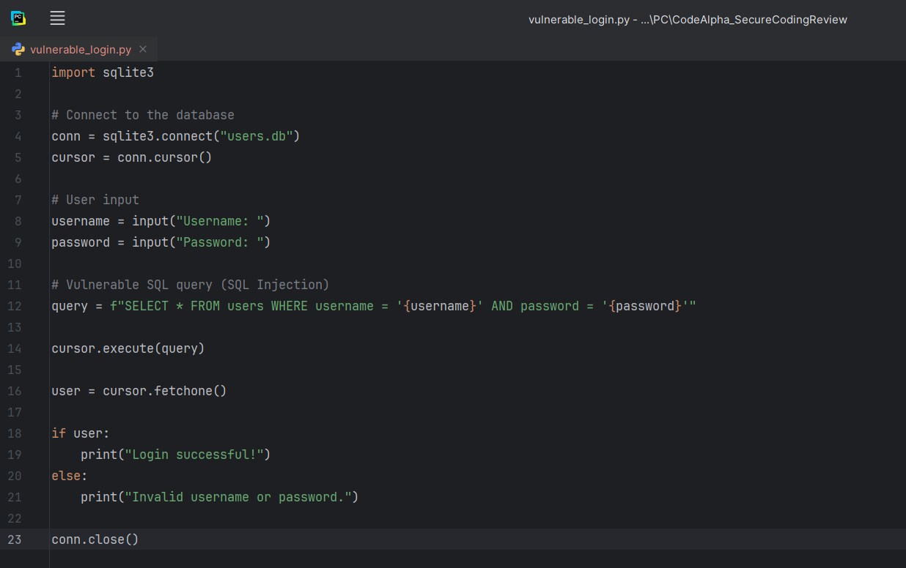
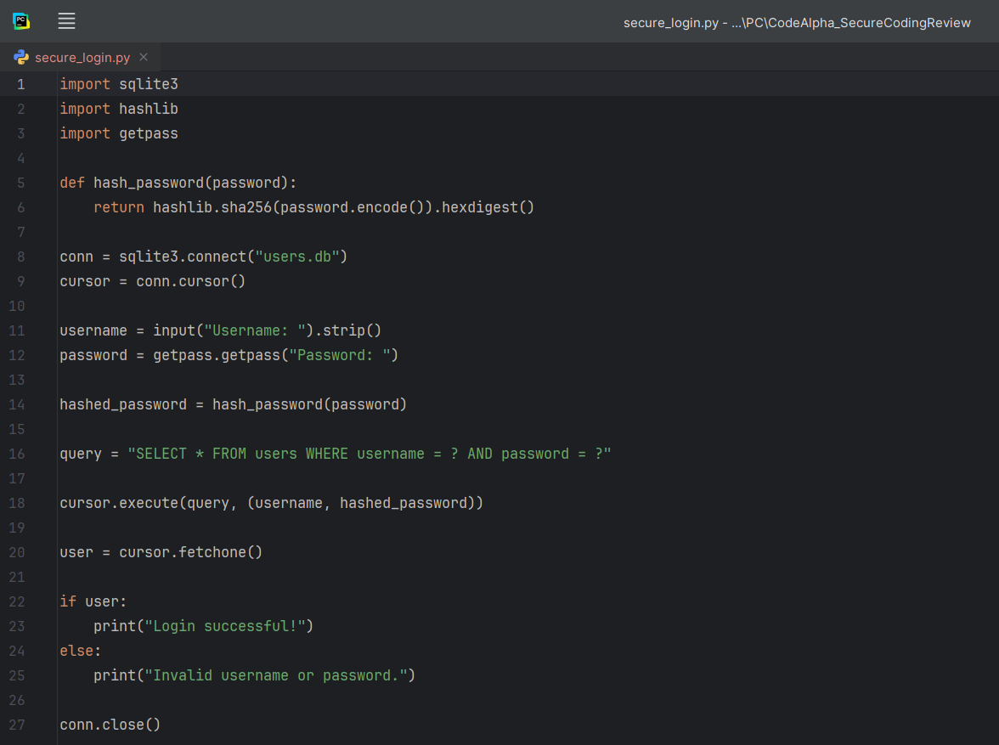

# 🔒 Secure Coding Review

A security code review project completed as part of the **CodeAlpha Cyber Security Internship**.

## 📌 Project Overview

This project demonstrates how to identify common security vulnerabilities in a Python login application and how to fix them using secure coding practices.

The repository contains both:

- ❌ A vulnerable implementation
- ✅ A secure implementation

---

## 📂 Project Structure

```
CodeAlpha_SecureCodingReview/
│
├── README.md
├── SECURITY_REVIEW_REPORT.md
├── vulnerable_login.py
├── secure_login.py
├── requirements.txt
└── screenshots/
```

---

## 📸 Screenshots

### Vulnerable Code



---

### Secure Code



---


## 🔍 Security Vulnerabilities Identified

| Vulnerability | Risk |
|--------------|------|
| SQL Injection | 🔴 High |
| Plain Text Password Storage | 🔴 High |
| Missing Password Hashing | 🔴 High |
| Missing Input Validation | 🟠 Medium |
| Poor Error Handling | 🟠 Medium |
| Missing Authentication Protection | 🟠 Medium |
| Missing Security Logging | 🟡 Low |

---

## ✅ Secure Coding Improvements

- Parameterized SQL Queries
- Password Hashing (SHA-256)
- Hidden Password Input
- Input Validation
- Improved Authentication
- Better Code Readability

---

## 📄 Files

| File | Description |
|------|-------------|
| vulnerable_login.py | Vulnerable login example |
| secure_login.py | Improved secure implementation |
| SECURITY_REVIEW_REPORT.md | Security assessment report |

---

## 🚀 Technologies

- Python 3
- SQLite
- hashlib
- getpass

---

## 🎯 Learning Objectives

- Identify common coding vulnerabilities
- Understand SQL Injection attacks
- Apply secure authentication techniques
- Follow secure coding best practices

---

## 👩‍💻 Author

**Agata Gabara**

CodeAlpha Cyber Security Internship

---

## 📜 License

This project was created for educational purposes.